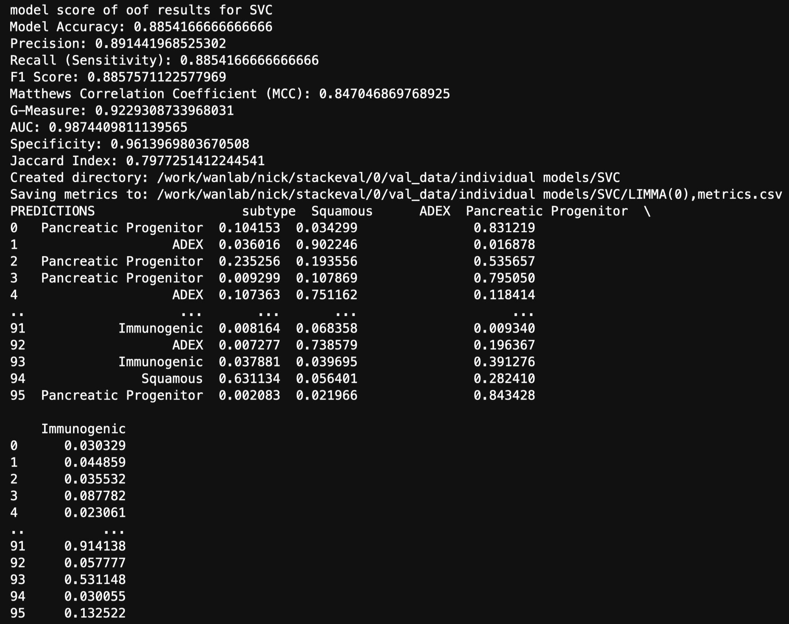

# MetaPaC: A Novel <ins>Meta</ins>-learning Model for <ins>Pa</ins>ncreatic <ins>C</ins>ancer Subtype Prediction <ins>B</ins>-cell <ins>A</ins>cute <ins>L</ins>ymphoblastic <ins>L</ins>eukemia
**MetaPaC** (an Ensemble stacking-Based Model for Identifying Pancreatic Cancer Subtypes), is an accurate and cost-effective model for based on RNA-seq Expression data only. Leveraging multiple different machine learning techniques, MetaPaC is able to identify accurately and efficiently predict 4 different Pcancreatic Cancer subtypes, which may valueble insights into the characteristics of these subtypes that can significantly aid clinical decision-making processes.

## Flowchart of MetaPaC


## Table of Contents
- [Installation](#installation)
- [Tutorials](#Tutorials)
- [Bug Report](#Bug-Report)
- [Authors](#Authors)
- [Publication](#Publication)
## Installation
1. Clone the MetaPaC git repository
```bash
git clone https://github.com/wan-mlab/MetaPaC.git
```
2. Navigate to the directory of RanBALL package
```bash
cd /your path/MetaPaC
pip install .
```
## Tutorials
### Jupyter notebook
1. Modify the System Path and import module
```bash
import sys; sys.path.append('MetaPaC')
from MetaPaC import MetaPaC
```
2. unzip and read the test file
```bash
test = pd.read_csv('filter_TPM_test.csv', index_col=0)
```
3. PaC subtype prediction
```bash
RanBALL.Predict(Exp = test, exp_type = 'TPM')
```
   exp_type also could be 'Raw_count' and 'FPKM', which would be transformed to TPM for model training.

4. Example Outputs



The prediction results will be stored and exported to a folder named stackeval (10 classifiers LOO) in your specified directory

## Bug Report

If you find any bugs or problems, or you have any comments on RanBALL, please don't hesitate to contact via email nickpeterson@unmc.edu or [Issues](https://github.com/wan-mlab/MetaPaC/issues).

## Authors
Mengtao Sun, Nick Peterson, Shibiao Wan, Xinchao Wu

## Publication
MetaPaC: A novel meta-learning model for pancreatic cancer subtype prediction
Nick Peterson, Mengtao Sun, Xinchao Wu, Jieqiong Wang, Shibiao Wan
bioRxiv TBD; doi: TBD

## License 

[](https://www.gnu.org/licenses/gpl-3.0)

GNU GENERAL PUBLIC LICENSE  
Version 3, 29 June 2007

This program is free software: you can redistribute it and/or modify
it under the terms of the GNU General Public License as published by
the Free Software Foundation, either version 3 of the License, or
(at your option) any later version.

This program is distributed in the hope that it will be useful,
but WITHOUT ANY WARRANTY; without even the implied warranty of
MERCHANTABILITY or FITNESS FOR A PARTICULAR PURPOSE.  See the
GNU General Public License for more details.

You should have received a copy of the GNU General Public License
along with this program.  If not, see <https://www.gnu.org/licenses/>.
